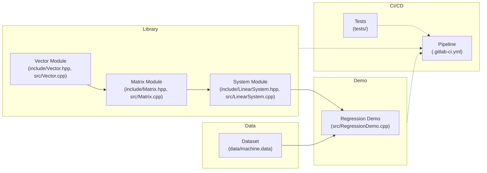

# cpp-linalg-regression

A C++17 library implementing dense linear-algebra primitives and solvers, plus a CPU-performance regression demo using the UCI “Computer Hardware” dataset.

---

## Features

- **Vector & Matrix**  
  - Heap-managed storage, deep-copy semantics  
  - Bounds-checked `operator[]` and 1-based `operator()`  
  - Unary (`+`, `-`) and binary (`+`, `-`, `*`) operators  

- **Advanced Matrix Ops**  
  - `determinant()`, `inverse()` for square matrices  
  - `pseudoInverse()` (Moore–Penrose) for arbitrary matrices  
  - Tikhonov regularization for non-square systems  

- **Linear System Solvers**  
  - `LinearSystem` (Gaussian elimination + pivoting)  
  - `PosSymLinSystem` (Conjugate Gradient for symmetric systems)  

- **Regression Demo**  
  - Six-feature linear model (`PRP` vs. `MYCT`, `MMIN`, `MMAX`, `CACH`, `CHMIN`, `CHMAX`)  
  - Train/test split with RMSE reporting  

- **Quality & Automation**  
  - Unit tests (Catch2) with ≥ 90% coverage  
  - Static analysis (`-Wall -Wextra -Werror`)  
  - GitLab CI pipeline: lint → build → test → coverage → deploy  

---

## Architecture

This project is structured for modular development, testing, and CI/CD delivery:



- **Library**: Core numerical types and algorithms (Vector, Matrix, LinearSystem).  
- **Demo**: Command-line regression application leveraging the library.  
- **Data**: Raw UCI dataset for CPU performance.  
- **CI/CD**: Automated lint, build, test, coverage, and deploy stages, integrating tests and security scans.

---

## Repository Layout

```
/
├── CMakeLists.txt            # Build configuration
├── include/                 # Public headers
│   ├── Vector.hpp
│   ├── Matrix.hpp
│   └── LinearSystem.hpp
│
├── src/                     # Implementation
│   ├── Vector.cpp
│   ├── Matrix.cpp
│   ├── LinearSystem.cpp
│   └── RegressionDemo.cpp
│
├── tests/                   # Unit tests (Catch2)
│   ├── CMakeLists.txt
│   └── *.cpp
│
├── data/                    # Sample datasets
│   └── machine.data
│
├── .gitlab-ci.yml           # CI/CD pipeline definition
└── README.md                # Project documentation
```

---

## Prerequisites

- **Compiler**: GCC 9+ or Clang 10+, with C++17 support  
- **CMake**: 3.12+  
- **Catch2**: integrated via FetchContent in CMake  
- **GitLab Runner** (for CI)  

---

## Build & Install

```bash
git clone https://gitlab.com/your-group/cpp-linalg-regression.git
cd cpp-linalg-regression
mkdir build && cd build
cmake .. -DCMAKE_BUILD_TYPE=Release
cmake --build . --parallel
cmake --install .
```

---

## Tests & Coverage

```bash
# Run tests
ctest --output-on-failure

# Coverage (requires lcov & genhtml)
make coverage
# Open coverage/index.html
```

---

## Regression Demo

```bash
./RegressionDemo \
  --data ../data/machine.data \
  --train-split 0.8 \
  --seed 42
```

**Output:**  
- Coefficients `x_1 … x_6`  
- Train RMSE, Test RMSE  

---

## CI/CD Overview

- **Stages:**  
  1. **Lint** (`-Wall -Wextra -Werror`)  
  2. **Build** (Debug & Release)  
  3. **Test** (`ctest --parallel`)  
  4. **Coverage** (≥ 90% threshold)  
  5. **Deploy** (publish artifacts)  
  6. **Security** (SAST & dependency scans)  

- **Triggers:** on push and merge requests  
- **Protected branches:** `main`, `dev` require passing pipelines & approval  
- **Badges:** build status & coverage in README  
- **Retention:** keep last 5 successful artifacts  

---

## Contributing

1. Fork & clone  
2. Create branch (`feature/…`)  
3. Commit with clear messages  
4. Open MR against `dev`  
5. Pass all CI checks  

---

## License

MIT License — see [LICENSE](LICENSE) for details.
