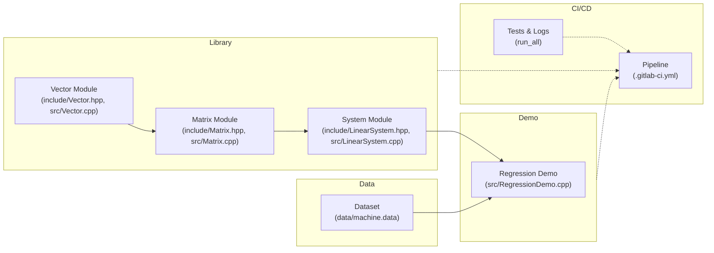

##  C++ Linear Algebra Regression Library
---
Read full report here: https://www.overleaf.com/read/cdxsgxjjkyrs#0a79a2. Description: a C++17 library implementing dense linear-algebra primitives and solvers, plus a CPU-performance regression demo using the UCI “Computer Hardware” dataset.
### Output:
```bash
# Run all Task A tests
./unit_tests "Vector*,Matrix*,Gaussian*,Conjugate*"
===============================================================================
All tests passed (37 assertions in 8 test cases)
---
# Run regression demo
./RegressionDemo --data ../data/machine.data --train-split 0.8 --seed 42
RegressionDemo v1.0
Loaded 209 samples (167 train / 42 test)

Coefficients (x1..x7):
  x1 = -0.031743
  x2 =  0.014001
  x3 =  0.005004
  x4 =  0.399885
  x5 = -0.669655
  x6 =  1.197054
  x7 = -0.658987

Train RMSE: 60.508298
Test  RMSE: 44.209718
---
```

## Features

* **Vector & Matrix**

  * Heap-managed storage, deep-copy semantics
  * Bounds-checked `operator[]` and 1-based `operator()`
  * Unary (`+`, `-`) and binary (`+`, `-`, `*`) operators

* **Advanced Matrix Ops**

  * `determinant()`, `inverse()` for square matrices
  * `pseudoInverse()` (Moore–Penrose) for arbitrary matrices
  * Tikhonov regularization for non-square systems

* **Linear System Solvers**

  * `LinearSystem` (Gaussian elimination + pivoting)
  * `PosSymLinSystem` (Conjugate Gradient for symmetric systems)

* **Regression Demo**

  * Six-feature linear model (`PRP` vs. `MYCT`, `MMIN`, `MMAX`, `CACH`, `CHMIN`, `CHMAX`)
  * Train/test split with RMSE reporting

* **Automation & Logging**

  * CMake targets: `run_tests`, `run_demo`, `run_all` for building, testing, and capturing logs
  * Helper script under `scripts/run_project.sh` for one-step execution and log collection

* **Quality & CI/CD**

  * Unit tests (Catch2) with ≥ 90% coverage
  * Static analysis (`-Wall -Wextra -Werror`)
  * GitLab CI pipeline: lint → build → test → coverage → deploy

---

## Architecture

This project is structured for modular development, testing, and CI/CD delivery. Below is the core architecture rendered using Mermaid:



---

## Repository Layout

```
/
├── CMakeLists.txt            # Build configuration, custom run targets
├── include/                  # Public headers
│   ├── Vector.hpp
│   ├── Matrix.hpp
│   └── LinearSystem.hpp
│
├── src/                      # Implementations
│   ├── Vector.cpp
│   ├── Matrix.cpp
│   ├── LinearSystem.cpp
│   └── RegressionDemo.cpp
│
├── tests/                    # Unit tests (Catch2)
│   ├── CMakeLists.txt
│   ├── test_vector.cpp
│   ├── test_matrix.cpp
│   ├── test_system.cpp
│   ├── test_data.cpp
│   └── test_regression.cpp
│
├── data/                     # Sample datasets
│   └── machine.data
│
├── scripts/                  # Helper scripts
│   └── run_project.sh        # Build, test, demo, log
│
├── .gitlab-ci.yml            # CI/CD pipeline definition
└── README.md                 # Project documentation
```

---

## Prerequisites

* **Compiler**: GCC 9+ or Clang 10+, with C++17 support
* **CMake**: 3.12+
* **Catch2**: integrated via FetchContent in CMake
* **GitLab Runner** (for CI) or **GitHub Actions** as alternative

---

## Build & Install

```bash
git clone git@github.com:Minhcardanian/cpp-linalg-regression.git
cd cpp-linalg-regression
mkdir build && cd build
cmake .. -DCMAKE_BUILD_TYPE=Release
cmake --build . --parallel
cmake --install .
```

---

## Running Tests & Demo

### Using CMake Targets

```bash
# Build and run all tests and demo, capture logs
cd build
cmake --build . --target run_all

# Logs are generated in:
build/logs/tests.log
build/logs/regression.log
```

### Using Script

```bash
# From project root
chmod +x scripts/run_project.sh
./scripts/run_project.sh
```
```bash
# 2. Configure the build
cmake .. -DCMAKE_BUILD_TYPE=Release

# 3. Compile all targets in parallel
cmake --build . --parallel

# 4. Run the full test suite
ctest --output-on-failure

# 5. (Optional) Run only Task A unit tests
./unit_tests "Vector*,Matrix*,Gaussian*,Conjugate*

# 6. Run task B
./RegressionDemo --data ../data/machine.data --train-split 0.8 --seed 42
```
---

## CI/CD Overview

* **Stages:**

  1. **Lint** (`-Wall -Wextra -Werror`)
  2. **Build** (Debug & Release)
  3. **Test** (`ctest --parallel`)
  4. **Coverage** (≥ 90% threshold)
  5. **Deploy** (publish artifacts)
  6. **Security** (SAST & dependency scans)

* **Triggers:** on push and merge requests

* **Protected branches:** `main`, `dev` require passing pipelines & approval

* **Badges:** build status & coverage in README

* **Retention:** keep last 5 successful artifacts

---

## Contributing

1. Fork & clone
2. Create branch (`feature/…`)
3. Commit with clear messages
4. Open MR against `dev`
5. Pass all CI checks

---

## License

MIT License — see [LICENSE](LICENSE) for details.
